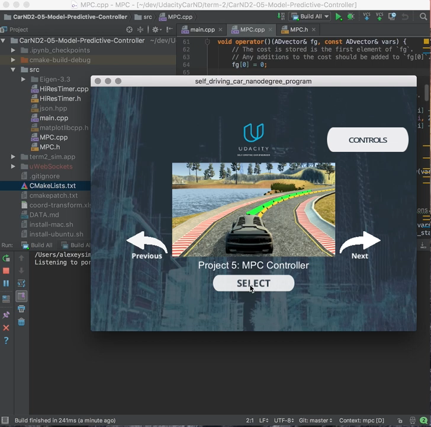
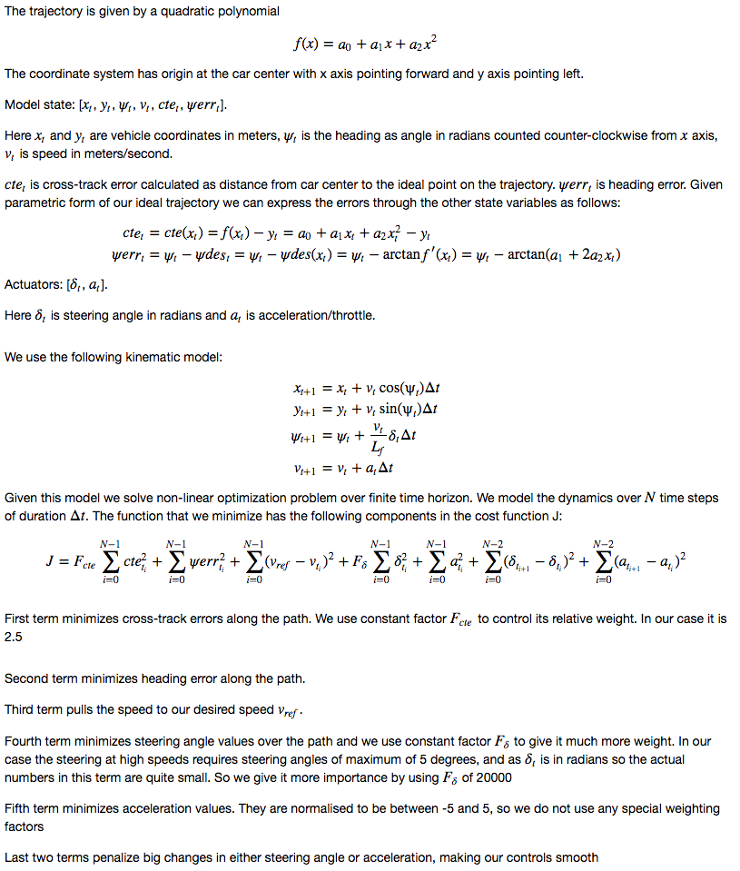

# Model Predictive Controller
Final project in Term 2 of Udacity Self-Driving Car Engineer Nanodegree Program.

Using kinematic model of car motion to find optimal controls to steer a car around
the track. The car receives telemetery events from simulator, which include car position,
velocity and heading, as well as waypoints for the path to follow. The controller finds
optimal steering angle and throttle and sends it back to the simulator to actuate
the car. Background can be found on [wikipedia](https://en.wikipedia.org/wiki/Model_predictive_control)

Here is a video of the final implementation pushed to its limits, given 100 millisecond
latency in actuation:

---

## The Model

## Timestep Length and Frequency

After playing with various settings we have settled on N=16 and delta_t=100 milliseconds.
This projects car trajectory out for 1.6 seconds and at speeds around 80-100 mph covers
just the right distance around the corners to incorporate enough information from the future
into our current controls.

We have tried smaller N. It speeds up the calculation and results in less errors but the performance
is not as good, in terms of stability at higher speeds. With the current settings the solver
find solution almost always and is limited to 20 milliseconds to do this.

We take average of two first calculated actuations and use them to steer the car until the
next measurement. Then we repeat the process from new position/state.

## Polynomial Fitting and MPC Preprocessing

As mentioned before we fit a quadratic polynomial to provided waypoints.
It works nicely. We also calculate curvature of the curve at the point where the car is
to adjust our reference speed. When curvature is less than 70 meters we reduce the reference
speed to 65mph. Otherwise we try to achieve 95mph. This results in car braking into the tight corners
and accelerating out of the corners.

We do not preprocesses waypoints, the vehicle state, and/or actuators 
in any way prior to the MPC procedure.

## Model Predictive Control with Latency

We use hard-enforced latency of 100 milliseconds before sending the controls to the car,
mimicking the real world.
To achieve this `this_thread::sleep_for` function from C++ standard library is used.
We also verify this by utilising `chrono::high_resolution_clock` to measure all the calculations/latencies.

Empirically we see that calculations take 20ms, sleep_for takes 105ms and the latency between
sending controls and receiving next telemetry message is 19ms, on average.

To deal with latency gracefully we take the original state from telemetery measurement and
apply our motion equations to estimate x,y and heading after 120ms in the future. This is
the initial state we solve our optimization problem from.

This results in very good approximation for speeds up to 100 mph. How do we know this?
This is visually obvious
as we pass the ideal trajectory into simulator to be drawn in front of the car as yellow line.
Our input waypoints are given in global coordinates. 
But for visualization we pass them into the simulator in the car coordinates. 
So they have to be adjusted by the position of the car at the time the simulator draws them.
And that is after the latency we enforce.
So what we see in our implementation is the yellow line is very stable and in the middle of the road. 

---

## Dependencies

* cmake >= 3.5
 * All OSes: [click here for installation instructions](https://cmake.org/install/)
* make >= 4.1
  * Linux: make is installed by default on most Linux distros
  * Mac: [install Xcode command line tools to get make](https://developer.apple.com/xcode/features/)
  * Windows: [Click here for installation instructions](http://gnuwin32.sourceforge.net/packages/make.htm)
* gcc/g++ >= 5.4
  * Linux: gcc / g++ is installed by default on most Linux distros
  * Mac: same deal as make - [install Xcode command line tools]((https://developer.apple.com/xcode/features/)
  * Windows: recommend using [MinGW](http://www.mingw.org/)
* [uWebSockets](https://github.com/uWebSockets/uWebSockets) == 0.14, but the master branch will probably work just fine
  * Follow the instructions in the [uWebSockets README](https://github.com/uWebSockets/uWebSockets/blob/master/README.md) to get setup for your platform. You can download the zip of the appropriate version from the [releases page](https://github.com/uWebSockets/uWebSockets/releases). Here's a link to the [v0.14 zip](https://github.com/uWebSockets/uWebSockets/archive/v0.14.0.zip).
  * If you have MacOS and have [Homebrew](https://brew.sh/) installed you can just run the ./install-mac.sh script to install this.
* [Ipopt](https://projects.coin-or.org/Ipopt)
  * Mac: `brew install ipopt --with-openblas`
  * Linux
    * You will need a version of Ipopt 3.12.1 or higher. The version available through `apt-get` is 3.11.x. If you can get that version to work great but if not there's a script `install_ipopt.sh` that will install Ipopt. You just need to download the source from the Ipopt [releases page](https://www.coin-or.org/download/source/Ipopt/) or the [Github releases](https://github.com/coin-or/Ipopt/releases) page.
    * Then call `install_ipopt.sh` with the source directory as the first argument, ex: `bash install_ipopt.sh Ipopt-3.12.1`. 
  * Windows: TODO. If you can use the Linux subsystem and follow the Linux instructions.
* [CppAD](https://www.coin-or.org/CppAD/)
  * Mac: `brew install cppad`
  * Linux `sudo apt-get install cppad` or equivalent.
  * Windows: TODO. If you can use the Linux subsystem and follow the Linux instructions.
* [Eigen](http://eigen.tuxfamily.org/index.php?title=Main_Page). This is already part of the repo so you shouldn't have to worry about it.
* Simulator. You can download these from the [releases tab](https://github.com/udacity/CarND-MPC-Project/releases).

## Basic Build Instructions

1. Clone this repo.
2. Make a build directory: `mkdir build && cd build`
3. Compile: `cmake .. && make`
4. Run it: `./mpc`.

## The simulator

Can be found [here](https://github.com/udacity/self-driving-car-sim/releases). Version 1.3+.

